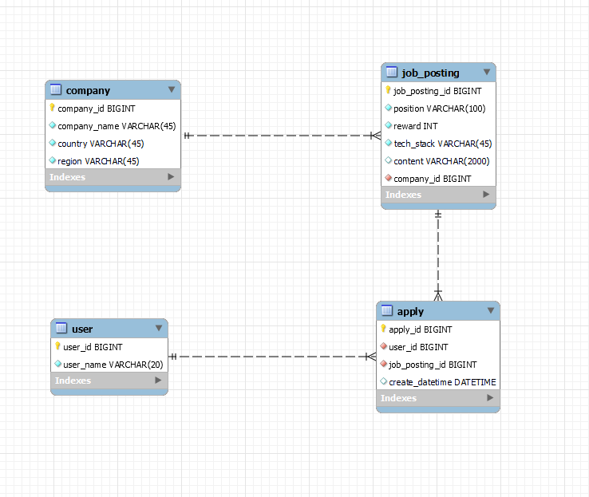

# wanted-pre-onboarding-backend

프리온보딩 백엔드 인턴십 선발과제

## 사용 언어 및 프레임워크

- JAVA 11
- Spring Boot 2.7

## 서비스 개요

- 본 서비스는 기업의 채용을 위한 웹 서비스 입니다.
- 회사는 채용공고를 생성하고, 이에 사용자는 지원합니다.

## 요구사항 및 구현 과정

### -. 사용자와 기업의 사전 정보를 등록합니다.
사용자와 기업의 정보를 등록할 수 있습니다.

```json
// 사용자 등록
request - POST http://localhost/user

body
{
  "userName":"김이름"
}

// 기업 등록
request - POST http://localhost/company

body
{
  "companyName":"원티드랩",
  "country":"한국",
  "region":"서울"
}
```

### 1. 채용공고를 등록합니다.

```json

request - POST https://localhost/job-posting

body
{
  "companyId":회사_id,
  "position":"백엔드 주니어 개발자",
  "reward":1000000,
  "content":"원티드랩에서 백엔드 주니어 개발자를 채용합니다. 자격요건은..",
  "techStack":"Python"
}
```

- <code>companyId</code> 가 있어야 등록 가능합니다.

### 2. 채용공고를 수정합니다.

회사 id 이외 모두 수정 가능합니다.

```json

request - PUT http://localhost/job-posting/{jobPostingId}

body
{
  "position":"백엔드 주니어 개발자",
  "reward":1500000, # 변경됨
  "content":"원티드랩에서 백엔드 주니어 개발자를 '적극' 채용합니다. 자격요건은..", # 변경됨
  "techStack":"Python"
}

or

{
  "position":"백엔드 주니어 개발자",
  "reward":1000000,
  "content":"원티드랩에서 백엔드 주니어 개발자를 채용합니다. 자격요건은..",
  "techStack":"Django" # 변경됨
}
```

- 비어있는 항목이 없어야 합니다.

### 3. 채용공고를 삭제합니다.

DB에서 삭제됩니다.

```
request - DELETE http://localhost/job-posting/{jobPostingId}
```

- <code>jobPostingId</code>를 기준으로 삭제됩니다.

### 4. 채용공고 목록을 가져옵니다.

4-1. 사용자는 채용공고 목록을 아래와 같이 확인할 수 있습니다.

```json

request - GET http://localhost/job-posting
{
  "result": [
    {
	  "jobPostingId": 채용공고_id,
	  "companyName":"원티드랩",
	  "country":"한국",
	  "region":"서울",
	  "position":"백엔드 주니어 개발자",
	  "reward":1500000,
	  "techStack":"Python"
	},
	{
	  "jobPostingId": 채용공고_id,
	  "companyName":"네이버",
	  "country":"한국",
	  "region":"판교",
	  "position":"Django 백엔드 개발자",
	  "reward":1000000,
	  "techStack":"Django"
	},
  ...
  ],
  "state": "SUCCESS"
}
```

4.2 채용공고 검색 기능 구현 (선택사항)

```json

request - GET http://localhost/job-posting/search?keyword={검색어}

# Example - 1) search=원티드
{
  "result": [
    {        
	  "jobPostingId": 채용공고_id,
	  "companyName":"원티드랩",
	  "country":"한국",
	  "region":"서울",
	  "position":"백엔드 주니어 개발자",
	  "reward":1500000,
	  "techStack":"Python"
	},
	{
	  "jobPostingId": 채용공고_id,
	  "companyName":"원티드코리아",
	  "country":"한국",
	  "region":"부산",
	  "position":"프론트엔드 개발자",
	  "reward":500000,
	  "techStack":"javascript"
	}],
  "state": "SUCCESS"
}

# Example - 2) search=Django
{
  "result": [
     {
      "jobPostingId": 채용공고_id,
	  "companyName":"네이버",
	  "country":"한국",
	  "region":"판교",
	  "position":"Django 백엔드 개발자",
	  "reward":1000000,
	  "techStack":"Django"
	},
	{
	  "jobPostingId": 채용공고_id,
	  "companyName":"카카오",
	  "country":"한국",
	  "region":"판교",
	  "position":"Django 백엔드 개발자",
	  "reward":500000,
	  "techStack":"Python"
	}
  ...
  ],
  "state": "SUCCESS"
}
```

## 5. 채용 상세 페이지를 가져옵니다.

사용자는 채용상세 페이지를 아래와 같이 확인할 수 있습니다.

- "채용 내용"이 추가적으로 담겨 있음.
- 해당 회사가 올린 다른 채용공고가 추가적으로 포함됩니다. (선택사항)

```json

request - GET http://localhost/job-posting/{jopPostingId}

{
  "result": {
        "jobPostingId": 채용공고_id,
        "companyName":"원티드랩",
        "country": "한국",
        "region": "서울",
        "position": "백엔드 주니어 개발자",
        "reward": 1500000,
        "techStack":"Python",
        "content": "원티드랩에서 백엔드 주니어 개발자를 채용합니다. 자격요건은..",
        "otherJobPostingList":[채용공고_id, 채용공고_id, ..] # id List (선택사항 및 가산점요소).
        },
  "state":"SUCCESS"
}
```

## 6. 사용자는 채용공고에 지원합니다. (선택사항)

사용자는 채용공고에 아래와 같이 지원합니다.

- 사용자는 1회만 지원 가능합니다.

```json

request - Post http://localhost/apply

body
{
  "jobPostingId": 채용공고_id,
  "userId": 사용자_id
}
```

## DB ERD

- MySQL


